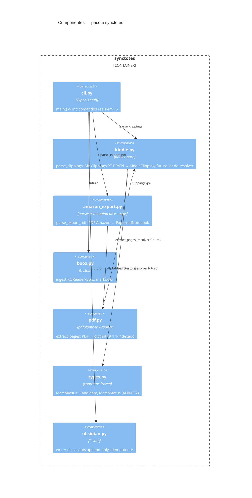

# C4 — Nível 3: Componentes (container CLI synctotes)

> Gerado pelo Reversa Architect em 2026-07-02.
> Único container de código; componentes = módulos do pacote.

## Responsabilidades e dependências 🟢

| Componente | Depende de | Usado por | Pureza |
|---|---|---|---|
| `types` | — | kindle (futuro), cli (futuro) | dados imutáveis |
| `pdf` | pdfplumber | resolver futuro, testes | função pura sobre I/O de leitura |
| `kindle` | stdlib apenas | cli futuro; amazon_export (ClippingType) | puro (str → dataclasses) |
| `amazon_export` | pdfplumber, kindle.ClippingType | cli futuro | puro após extração |
| `boox` 🔴 | — | cli futuro | — |
| `obsidian` 🔴 | — | cli futuro | única escrita em disco do sistema |
| `cli` 🔴 | typer, rich (declarados) | usuário | casca imperativa |

## Observações arquiteturais

- 🟡 `amazon_export` chama pdfplumber diretamente em vez de reutilizar `pdf.extract_pages` — justificável (precisa do texto corrido, não paginado), mas duplica a fronteira com a lib externa; candidato a unificação quando o resolver nascer.
- 🟢 Nenhum módulo de domínio importa framework (Typer/rich ficam confinados ao `cli.py` futuro) — baixo acoplamento conforme contrato.
- 🟢 O resolver planejado vive em `kindle.py` (docstring), mas consumirá `pdf.extract_pages` e `rapidfuzz`; 🟡 considerar módulo próprio (`resolver.py`) para não inchar o parser — decisão em aberto para F6.
