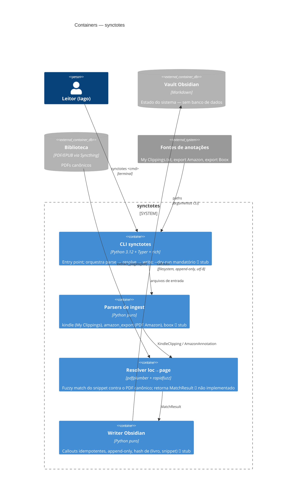

# C4 — Nível 2: Containers

> Gerado pelo Reversa Architect em 2026-07-02.

## Comunicação entre containers 🟢

Toda comunicação é **chamada de função em processo único** com dataclasses imutáveis como contrato — não há serviços, filas ou IPC. "Containers" aqui são fronteiras lógicas de responsabilidade dentro de um único processo CLI.

| De → Para | Contrato |
|---|---|
| parsers → resolver | `KindleClipping`, `AmazonAnnotation` (frozen) |
| resolver → writer | `MatchResult` (frozen; guardrail #1) |
| pdf → resolver | `dict[int, str]` denso 1-indexado |
| writer → vault | Markdown append-only com `encoding="utf-8"` |
