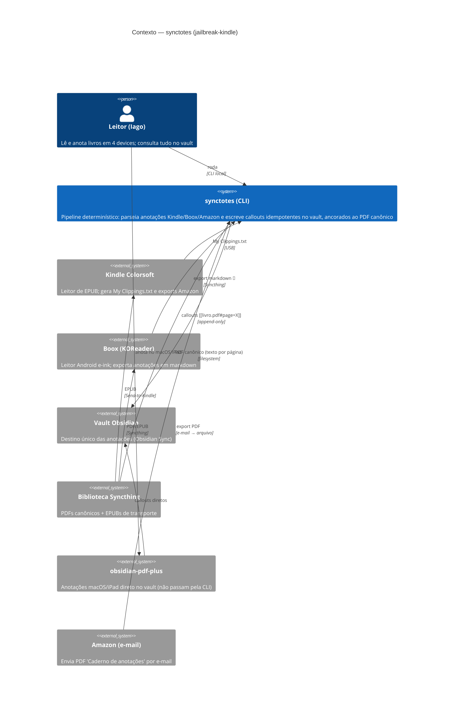

# C4 — Nível 1: Contexto

> Gerado pelo Reversa Architect em 2026-07-02.

## Leitura

- O **caminho macOS/iPad não passa pela CLI**: `obsidian-pdf-plus` anota direto no vault com âncora de página 🟢.
- A CLI existe para os devices cujas anotações nascem em coordenadas erradas (location de EPUB) ou formatos alheios ao vault: Kindle e Boox 🟢.
- Fluxo Boox 🔴: formato de export e transporte ainda não fixados.
