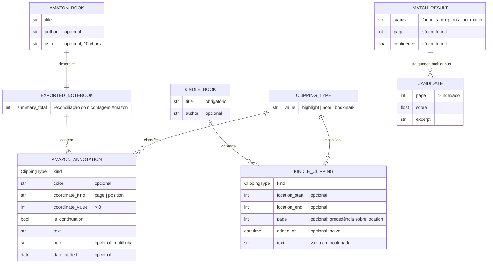

# ERD — jailbreak-kindle (`synctotes`)

> Gerado pelo Reversa Architect em 2026-07-02.
> Não há banco de dados 🟢: as "entidades" são dataclasses imutáveis em memória; relacionamentos por composição, sem chaves persistidas. Cardinalidades refletem a estrutura dos objetos.

## Relações entre agregados 🟡

`KindleClipping` e `AmazonAnnotation` descrevem o **mesmo fato de domínio** (uma anotação de leitura) vindo de fontes diferentes, mas **não há hoje modelo unificado** que os reconcilie — nem chave natural conectando `KindleBook.title` a `AmazonBook.title/asin`. Essa unificação (🔴 LACUNA 7 do domain.md) será forçada quando resolver e writer existirem, pois o callout precisa de identidade única de livro e de highlight (hash de idempotência do guardrail #6).

## Persistência

| Aspecto | Situação |
|---|---|
| Banco de dados | inexistente por decisão 🟢 |
| Estado durável | o próprio vault (Markdown) 🟢 |
| Identidade de highlight | hash estável de (livro, snippet normalizado) 🔴 algoritmo não definido |
