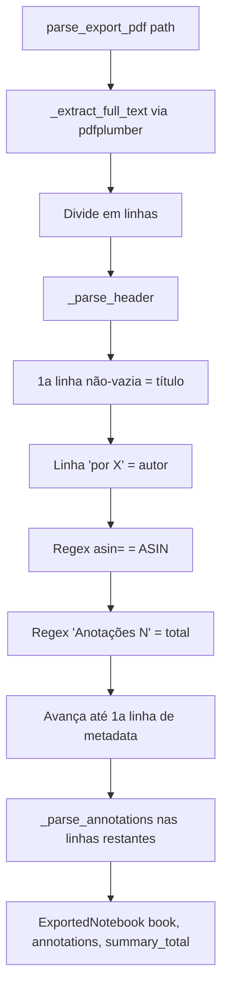
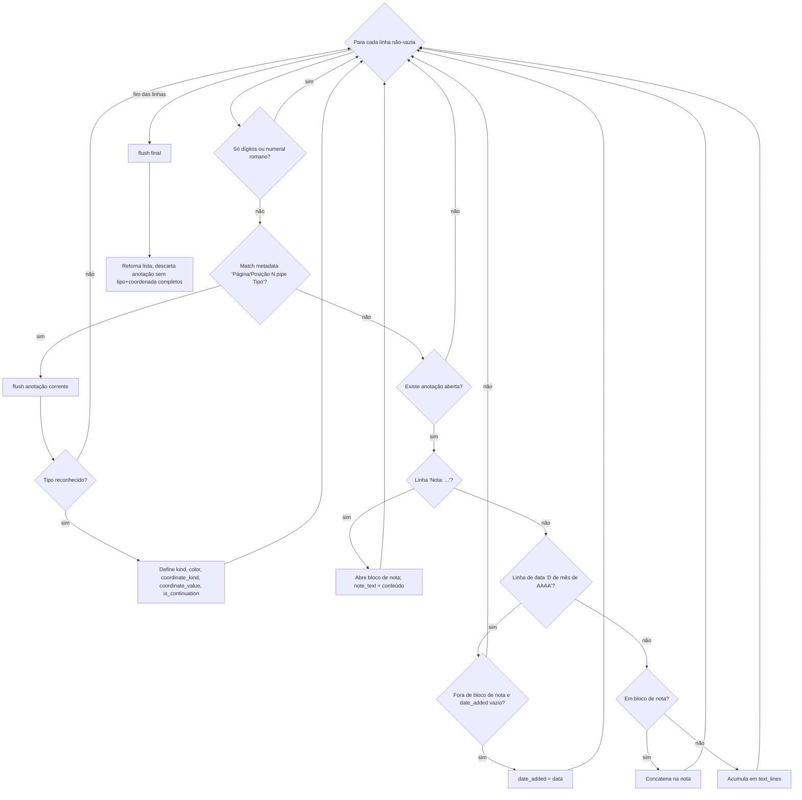

# Fluxograma — módulo `amazon_export`

> `parse_export_pdf` e máquina de estados `_parse_annotations`. Gerado pelo Reversa Archaeologist em 2026-07-02.

## Fluxo principal

## Máquina de estados `_parse_annotations`

## Notas

- Mapeamento de tipo: `Continuação do destaque` → HIGHLIGHT com `is_continuation=True`; `Destaque` → HIGHLIGHT; `Marcador` → BOOKMARK; `Nota` → NOTE.
- Reconciliação com o sumário Amazon: `itens_sem_continuação + notas_anexadas == summary_total` (semântica invertida em relação à contagem da Amazon — documentada em `test_total_annotations_match_summary`).
- Linhas só-dígitos e romanos são ruído estrutural do próprio PDF (paginação e frontmatter).
