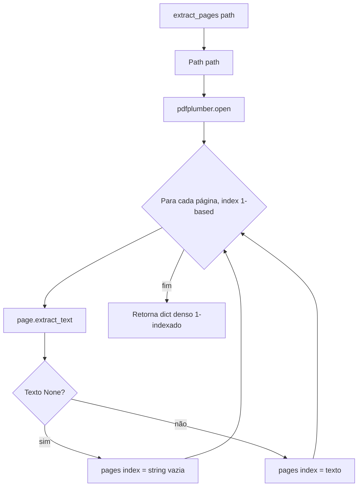

# Fluxograma — módulo `pdf`

> `extract_pages`. Gerado pelo Reversa Archaeologist em 2026-07-02.

## Notas

- 1-indexado por convenção humana e pelo formato de link `[[livro.pdf#page=X]]`.
- Mapeamento denso: toda página de 1 a N presente, vazia = `""`.
- Exceções do pdfplumber propagam sem captura (erros barulhentos).
