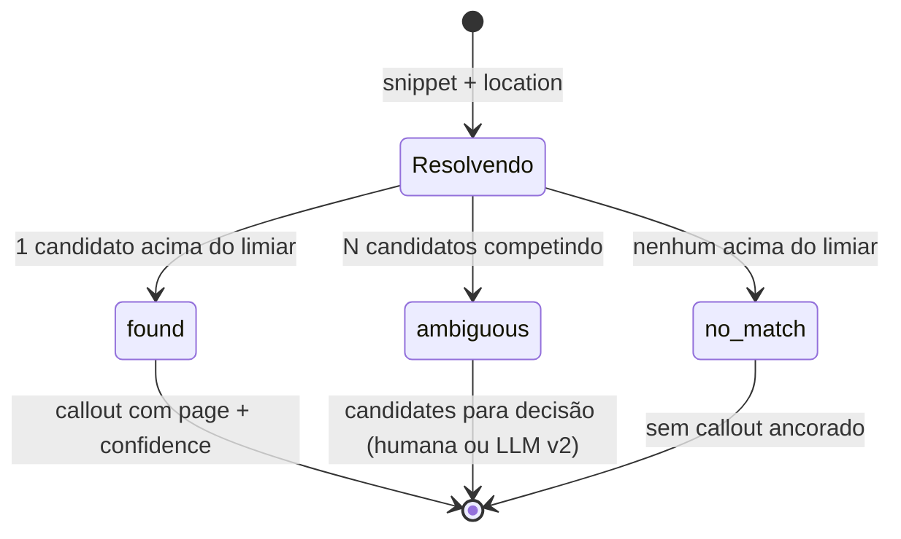
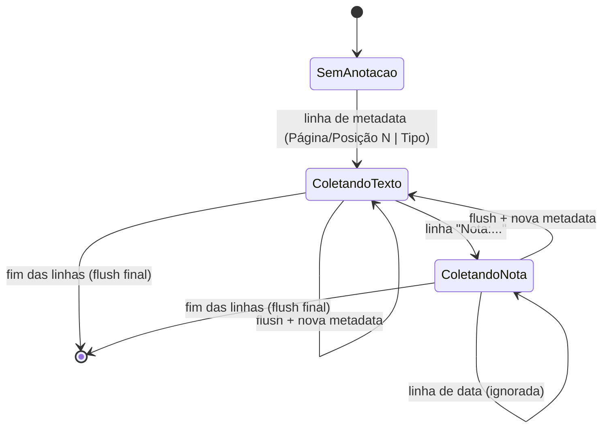

# Máquinas de Estado — jailbreak-kindle (`synctotes`)

> Gerado pelo Reversa Detective em 2026-07-02.
> O sistema não persiste entidades com ciclo de vida; os "estados" aqui são (1) a taxonomia de resultado do resolver, (2) a máquina de estados do parser Amazon e (3) o fluxo de vida de uma anotação através do pipeline.

## 1. `MatchStatus` — taxonomia de resultado do resolver 🟢

Não é máquina de transições (um `MatchResult` é imutável e terminal), mas governa o despacho do pipeline:

- 🔴 LACUNA: limiar de score e comportamento do pipeline em `ambiguous`/`no_match` não implementados.
- 🟢 v2: decorator `LLMFallbackResolver` interceptará `ambiguous`/`no_match` (ADR-002).

## 2. Máquina de estados do parser `_parse_annotations` (amazon_export) 🟢

Estados implícitos no acumulador do parser:

Invariante do `flush()`: anotação só é emitida com tipo + coordenada completos; caso contrário é descartada 🟢.

## 3. Ciclo de vida de uma anotação no pipeline (visão alvo) 🟡

Reconstruído do ARCHITECTURE.md e dos stubs; as etapas à direita ainda não existem:

```mermaid
stateDiagram-v2
    [*] --> Capturada: leitor nativo (Kindle/Boox/macOS/iPad)
    Capturada --> Parseada: parse_clippings / parse_export_pdf / boox (futuro)
    Parseada --> Resolvida: resolver loc→page (futuro)
    Parseada --> Descartada: bloco malformado (silencioso hoje; log rich na CLI futura)
    Resolvida --> Escrita: writer obsidian.py (futuro) — se hash inédito
    Resolvida --> Deduplicada: hash de (livro, snippet) já existe no vault
    Escrita --> [*]: callout [[livro.pdf#page=X]] no vault
    Deduplicada --> [*]: no-op (idempotência, guardrail 6)
```

- Anotações vindas do macOS/iPad **não passam** pelo pipeline: o plugin `obsidian-pdf-plus` já grava direto no vault com âncora de página 🟢 (ADR-003/004).
- 🔴 LACUNA: destino das anotações `no_match`/`ambiguous` (fila de revisão? callout sem âncora? descarte?) não decidido.

## Ausências deliberadas

- Sem RBAC/status de usuário: sistema single-user, sem autenticação 🟢.
- Sem estados persistidos em banco: idempotência será derivada do conteúdo do vault, não de tabela de controle 🟢 (ARCHITECTURE.md: "estado em arquivos").
